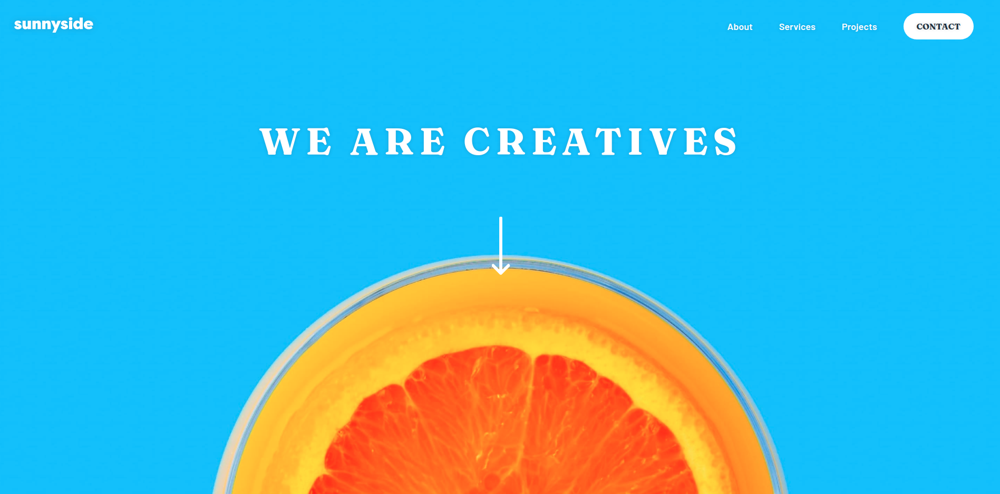

# Frontend Mentor - Sunnyside agency landing page solution

This is a solution to the [Sunnyside agency landing page challenge on Frontend Mentor](https://www.frontendmentor.io/challenges/sunnyside-agency-landing-page-7yVs3B6ef). Frontend Mentor challenges help you improve your coding skills by building realistic projects.

## Table of contents

- [Overview](#overview)
  - [The challenge](#the-challenge)
  - [Screenshot](#screenshot)
  - [Links](#links)
- [My process](#my-process)
  - [Built with](#built-with)
  - [What I learned](#what-i-learned)
  - [Continued development](#continued-development)
- [Author](#author)
- [Acknowledgments](#acknowledgments)

## Overview

### The challenge

Users should be able to:

- View the optimal layout for the site depending on their device's screen size
- See hover states for all interactive elements on the page

### Screenshot

### Links

- Solution URL: [https://www.frontendmentor.io/challenges/sunnyside-agency-landing-page-7yVs3B6ef/hub/html-scss-js-website-pPBvdwLmi](https://www.frontendmentor.io/challenges/sunnyside-agency-landing-page-7yVs3B6ef/hub/html-scss-js-website-pPBvdwLmi)
- Live Site URL: [https://youthful-brown-3cccd8.netlify.app/](https://youthful-brown-3cccd8.netlify.app/)

## My process

### Built with

- Semantic HTML5 markup
- SCSS
- Flexbox
- CSS Grid
- Mobile-first workflow
- [Vite.js](https://vitejs.dev/) - For build and development

### What I learned

SCSS project structure
First time with Vite ;)

### Continued development

I want to focus on improve my html + scss + js skills and than I want to complete these challenges using vue :)

## Author

- Github - [Mikołaj Szymczuk](https://github.com/mikolajszymczuk1)
- Frontend Mentor - [@mikolajszymczuk1](https://www.frontendmentor.io/profile/mikolajszymczuk1)

## Acknowledgments

LOVE SASS <3
